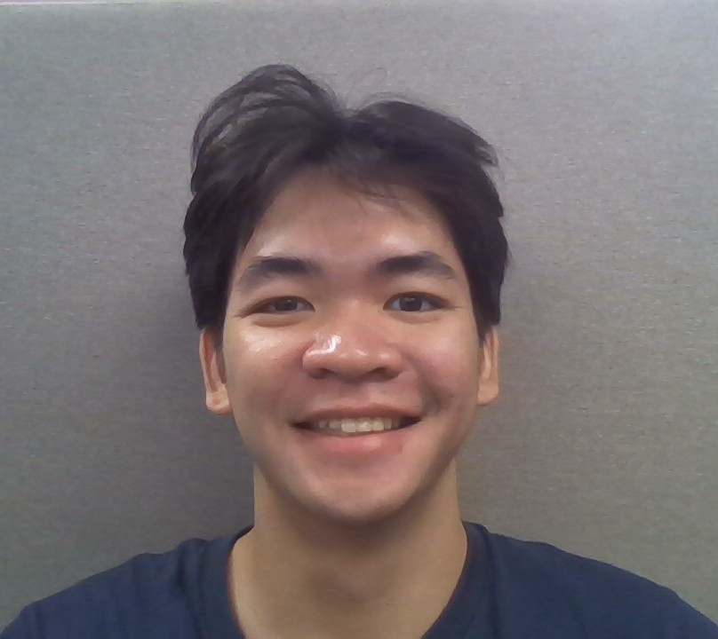
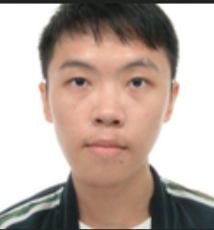

We are a team based in the [School of Computing, National University of Singapore](https://www.comp.nus.edu.sg).

You can reach us at the email `seer[at]comp.nus.edu.sg`

## Project team

### Jack Chua

[[github](http://github.com/jackchuayc)] 

* Role: Project Advisor

### Tze Min

[[github](https://github.com/L-TM)]

* Role: Developer

### Jovan Lo

[[github](http://github.com/snowlyr)] 

* Role: Developer

### Liu Yuqi

[[github](https://github.com/Liu-Yuqi-617)]

* Role: Developer

### He Qianyi

[[github](https://github.com/He-Qianyi)]

* Role: Developer
* Responsibilities: UI design
